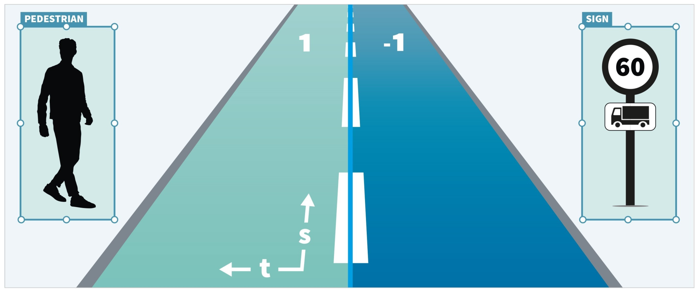
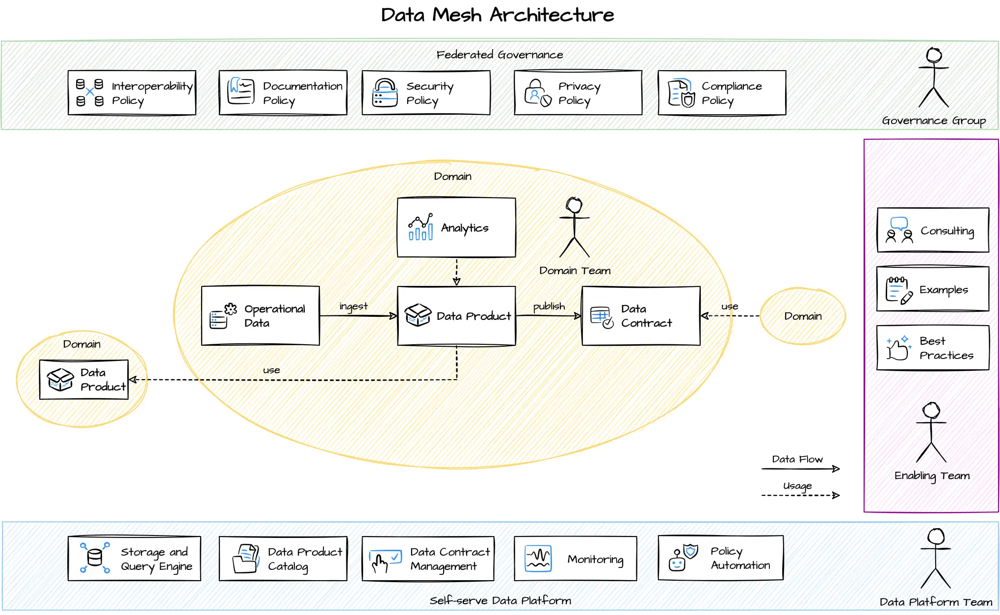

# Design choices for establishing data platform

## Data are the foundation for AI

Bad data means bad outputs.[[1]](#1)

Without having a data infrastructure in place, scaling will be difficult.\
Data piping and interoperability issues will consume most of the time for each use-case.

A well-designed data platform serves as the backbone\
enabling teams to find and consume existing data for a given use-case and publish outputs back for others to consume.\
It removes undifferentiated heavy lifting and enables data quality, accessibility, and governance across all initiatives.  

You don't need data platform to start with AI.\
But you will need one to do AI at scale.

## Core benefits of the data platform

Well-design data platform allows teams to:
- Find and consume existing data
- Publish new data products
- Provide data lineage and tracebility

If performance of a new algorithm version changed,\
was it because the new version is better, or because somebody changed the input dataset?

If your agent needs to access company data,\
will one need to spend weeks identifying data owner, getting approvals, and waiting for the responsible team to expose that data via MCP server,\
or does one just request access to the existing consumtion port via the data platform?

## Design options

So how does one setup such a data platform?

Since most companies leverage one of the major cloud providers in some way,\
my favorite setup is to leverage their storage backbone,\
and build or buy underlying data platform on top of it.

### Build vs buy

An evergreen question when leveraging any technology is whether to build or buy.

The scope, technical maturity, and customizations required are important inputs to this question.\
Building in-house will provide you total control and customization for your exact needs,\
while buying from vendor will provide you immediate access to features.

Either way, despite salespeople's promises, nothing works out of the box\
and tailoring solutions to your specific environment and use cases will be necessary in both scenarios.

### Data portability vs vendor lock-in

The speed of change is increasing.\
Your needs today might not be your needs tomorrow.\
The vendor that is the best match today might not exist tomorrow.\
Or might give you a price you might not be willing to pay.

Personally, I'd be uncomfortable giving up control over data ownership.

By leveraging block storage of major cloud providers (AWS, Azure, GCP)\
data are easily movable from one data lake to another.

`rclone copy aws-s3:my-s3-bucket gcp-gcs:my-gcs-bucket -P`


### Compute flexibility vs proprietary data formats 

By using open-source formats,\
one separates compute from storage\
and gets long-term flexibility in compute layer (Spark, Athena, BigQuery, Databricks, Snowflake).

Contrary, by adopting a proprietary format  from a specific vendor\
one might get an easier start and additional features in that particular ecosystem\
but your organization's future will get tied to that single vendor's ecosystem.

#### Apache Iceberg for tabular data [in progress]
Apache Iceberg format is an open table format\
enabling to store massive analytics datasets\
on reliable and cheap blob storage of major cloud providers (GCP Storage, Azure Blob, AWS S3),\
while providing ACID transactions, schema evolution, and timetravel capabilities.\

Moreoever, one is free to choose a (Spark, Athena, BigQuery, Databricks, Snowflake).
[[2]](#2)

 

```SQL
CREATE TABLE agent_sessions (
    session_id STRING NOT NULL,
    user_id STRING NOT NULL,
    agent_name STRING,
    started_at TIMESTAMP NOT NULL,
    ended_at TIMESTAMP,
    message_count INT,
    shared_with ARRAY<STRING>
);
```

#### OpenLABEL for multi-sensor data

ASAM OpenLABEL is an open, standardized JSON format\
enabling to store annotations across any sensor modality (cameras, LiDAR, radar, etc).

It has rich metadata capturing not just bounding boxes, but sensor calibration,\
coordinate systems, relationships between objects, and tracking IDs across frames.\
It's multimodal by design supporting 3D point clouds, 2D images, and sensor fusion scenario.[[3]](#3) 



```json
{
  "openlabel": {
    "objects": {  
      "1": {
        "name": "van1",
        "type": "Van"
      },
      "2": {
        "name": "cyclist2",
        "type": "Cyclist"
      },
      "16": {
        "name": "Ego-vehicle",
        "type": "Car"
      },
      "17": {
        "name": "road17",
        "type": "Road"
      }
    }
  }
}
```

## Central team vs Data Mesh

Data architecture is an organizational problem too, not just a technical one.\
In the past it was typical to have a central teams to serve all data needs.\
But as companies scale and data becomes mission-critical across every function,\
centralization has difficulty to keep up with the speed and data mesh setup comes in.

### Data Mesh

In data mesh domain teams own their data\
and are supported by a self-serve data platform\
enabling domain teams to easily build and share their own data products.[[4]](#4)





#### Example setup on AWS


#### Example setup on GCP


### Situations where central team might be a better fit

If the company has less than 100 employees or limited data maturity,\
need to establish foundational practices quickly, and have limited budget for distributed expertise,\
central team serving data needs might be a better fit for those scenarios.

Hybrid approaches are common too\
starting centralized and gradually federating ownership as domains mature encouraging experimentation and local optimization. 

## Summary

Data platforms transform from optional to essential as AI initiatives scale.\
While one can start AI projects without one, sustainable growth requires infrastructure\
that eliminates repetitive data piping and enables quality, accessibility, and governance.

The discussed approach leverages major cloud providers storage backbone with open-source formats on top.\
Apache Iceberg provides ACID transactions and schema evolution for tabular data, while OpenLABEL standardizes multi-sensor annotations.\
This architecture maintains data portability and compute flexibility.

Organizationally, data mesh architectures where domain teams own their data work best at scale,\
though centralized teams remain effective for smaller organizations or those establishing foundational practices.\
The key is establishing capabilities that let domain teams and agents publish, find, and consume data products.

## References
<a id="1"></a>[1] [arxiv.org: Data-Centric Artificial Intelligence](https://arxiv.org/html/2212.11854v4)\
<a id="2"></a>[2] [Apache Iceberg](https://iceberg.apache.org/)\
<a id="3"></a>[3] [ASAM/OpenLabel](https://www.asam.net/standards/detail/openlabel/)\
<a id="4"></a>[4] [Datamesh-Architecture](https://www.datamesh-architecture.com)

